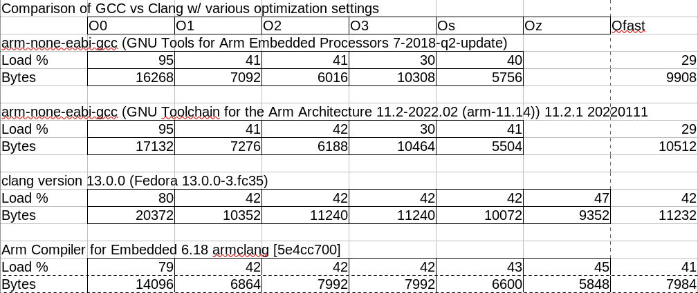
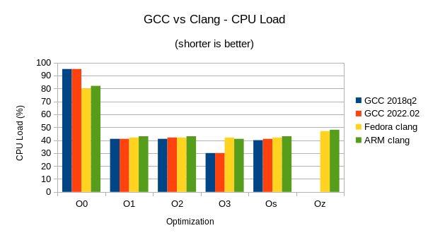
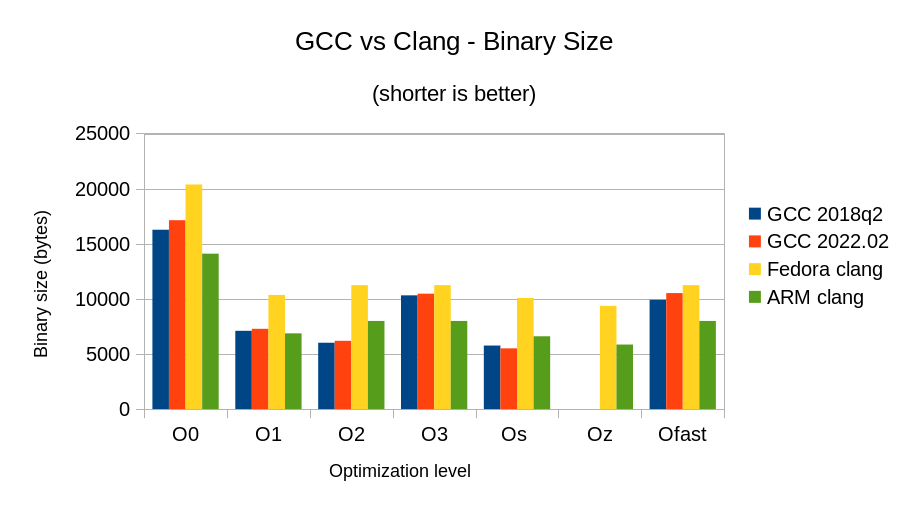

# f303k8_nucleo

A small collection of projects for the STM32F303K8 Nucleo devboard

## Overlay

A short little demo of using linker overlays to load executable code into a common area of on-chip RAM. Full details [here](./overlay)

## CLANG vs GCC shootout

The remainder of this README pertains to a test to try Clang vs GCC

## What's this all about?

In a recent lengthy thread over on a mail list I'm on there emerged an assertion that GCC is crap for embedded ARM programming and anyone who's serious about good performance should be using Clang. And not just any Clang, but the versions from Apple/ARM/etc which apparently have some sort of sekrit sawce that the free version doesn't. Now I've been using the Gnu ARM Embedded version of GCC for all my Cortex Mx development for the last decade or so (keeping up with the quarterly releases) and I've had no complaints, but I'm willing to entertain that there's something better so I tried to get some simple STM32F3xx stuff compiling w/ Clang.

## Compiling

I use GCC with a personalized Makefile that I've honed over the years and is
easy for me to maintain. It manages all the usual stuff like compiling C and assembly source, linking, disassembling and flashing to hardware. It manages all the optimization and target settings for STM32 builds so that I can quickly get new projects up and running. Clang behaves rather differently though so I needed some help to convert my flow to what's required on that toolchain. I did a lot of web searches and found the most detailed description here:

https://interrupt.memfault.com/blog/arm-cortexm-with-llvm-clang

This shows the broad strokes of how to adapt a GCC makefile for the free version of Clang and relies heavily on features of the free version which allow it to interact with your GCC install to find includes and libraries that are needed to complete the build. There are some errors and omissions but after a few hours I got it compiling using the free version of Clang that comes with my Fedora distibution.

I also wanted to test out a proprietary build of Clang since the discussion that spurred this experiment was very clear that the proprietary builds would produce better results than the free versions. In order to do this I applied for a 30-day free trial of the ARM Development Studio which includes version 6.18 of their Clang-based toolchain. This required a separate Makefile since ARM provides their own includes, libraries and a linker which uses radically different command syntax from the one used in the free version of Clang.

## Benchmarking

Having gotten two versions of Clang working, I began doing some benchmarks between it and two versions of GCC using a toy DSP application that's typical of the sort of thing I do in my day-to-day work. This yielded the following results:

### Notes

* This example is a simple audio DSP application running on an STM32F303K8 MCU with three channels of noise processed through a hardware floating point 4th-order filter model and streamed out to on-chip DACs via DMA. Sample rate is roughly 48ksps and the CPU is running at 64MHz clock rate.
* CPU load is computed by using the Cortex M4 cycle counter to measure the duration of the DMA buffer ISR. Time between IRQs is the period and duty cycle of the DSP is computed by sampling the start and end cycle counts. There are no significant I/O operations taking place during the measured time, only operatons to on-board SRAM. 100% load means that the DSP ISR is using all avaliable CPU cycles, so lower numbers indicate more efficient computations.
* Size is just the raw binary size of the full embedded application, including setup code.
* GCC does not have an -Oz setting so those values are left blank.
* I had posted some earlier results that were run at a slightly lower sample rate and thus had lower overall CPU load percentages. If you notice any differences between these results and the earlier ones it's caused by that change.

## Summary

Based on this one example it appears that recent builds of GCC are not grossly out of line with the performance of Clang in both the free and proprietary flavors. For all levels of optimization greater than -O0 GCC performs roughly as well if not better than either version of Clang. This test also shows very little difference between the free and proprietary versions of Clang.