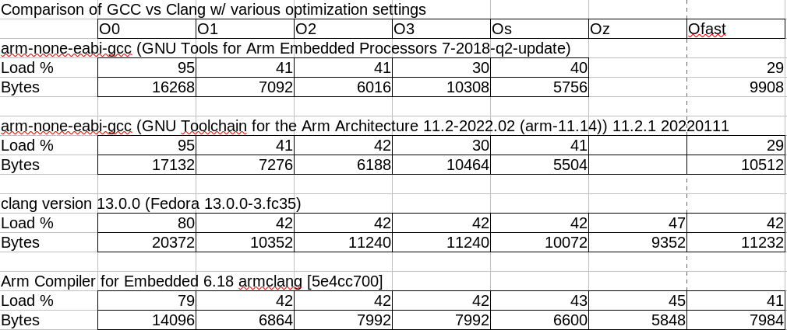

# f303k8_nucleo
Test to try Clang vs GCC

## What's this all about?
In a recent lengthy and contentious thread over on a mail list I'm on there emerged an assertion that GCC is crap for embedded ARM programming and anyone who's serious about good performance should be using Clang. And not just any Clang, but the versions from Apple/ARM/etc which apparently have some sort of sekrit sawce that the free version doesn't. Now I've been using the Gnu ARM Embedded version of GCC for all my Cortex Mx development for the last decade or so (keeping up with the quarterly releases) and I've had no complaints, but I'm willing to entertain that there's something better so I tried to get some simple STM32F3xx stuff compiling w/ Clang.

I found  a description here:

https://interrupt.memfault.com/blog/arm-cortexm-with-llvm-clang

This purports to show how to adapt a GCC makefile for Clang. There are some errors and omissions but after a few hours I got it compiling, 
BUT - upon trying to flash the code I got errors during the flash process, and it turns out that the linker is putting stuff in the wrong places (despite using the same linker script as GCC). Additionally, using objcopy to make a binary results in a 4GB file, so clearly things are screwed up.

I'm very inexperienced with debugging linker stuff - I mainly have just used Vendor linker scripts with minor tweaks in obvious places so figuring out what went wrong here is way beyond me. I've got .dmp and .map files from both the working GCC build and the failed Clang build but can't see where the errors are. If anyone has any suggestions I'd love to hear them and I can provide any data you'd need to lend a hand.

build dir is clang_test

linker results from GCC and Clang builds are in the clang_test/link_results dir

debug dumps from attempts to flash w/ OpenOCD are in the clang_test/oocd_debug dir

## Update 05-01-2022
I found a working example of clang with STM32 here:

https://github.com/piratkin/simple

Comparing the linker script in that example with my own I spotted a few differences. Resolving those has allowed the linker output .elf file to work correctly with OpenOCD and also with objcopy to generate a realistic raw binary file. However, it was necessary to remove references to the CCMRAM section that would allow initialization of code and variables in that area.

## Benchmarking 05-04-2022
Having gotten the open-source Clang working, I began doing some benchmarks between it and several versions of GCC. The results were interesting and not
quite aligned with what I'd been told about the relative performance of the two toolchains so I wanted to try a proprietary build of Clang as well. I signed up for a 30-day trial of the ARM Development Studio which provides version 6.18 of their Clang-based toolchain and got that working as well. This yeilded the following results:

### Notes
* This example is a simple audio DSP application running on an STM32F303K8 MCU with three channels of noise processed through a hardware floating point 4th-order filter model and streamed out to on-chip DACs via DMA. Sample rate is roughly 48ksps and the CPU is running at 64MHz clock rate.
* CPU load is computed by using the Cortex M4 cycle counter to measure the duration of the DMA buffer ISR. Time between IRQs is the period and duty cycle of the DSP is computed by sampling the start and end cycle counts. There are no significant I/O operations taking place during the measured time, only operatons to on-board SRAM. 100% load means that the DSP ISR is using all avaliable CPU cycles, so lower numbers indicate more efficient computations.
* Size is just the raw binary size of the full embedded application, including setup code.
* GCC does not have an -Oz setting so those values are left blank.
* I had posted some earlier results that were run at a slightly lower sample rate and thus had lower overall CPU load percentages. If you notice any differences between these results and the earlier ones it's caused by that change.

## Summary
Based on this one example it appears that recent builds of GCC are not grossly out of line with the performance of Clang in both the free and proprietary flavors. For all levels of optimization greater than -O0 GCC performs roughly as well if not better than either version of Clang.